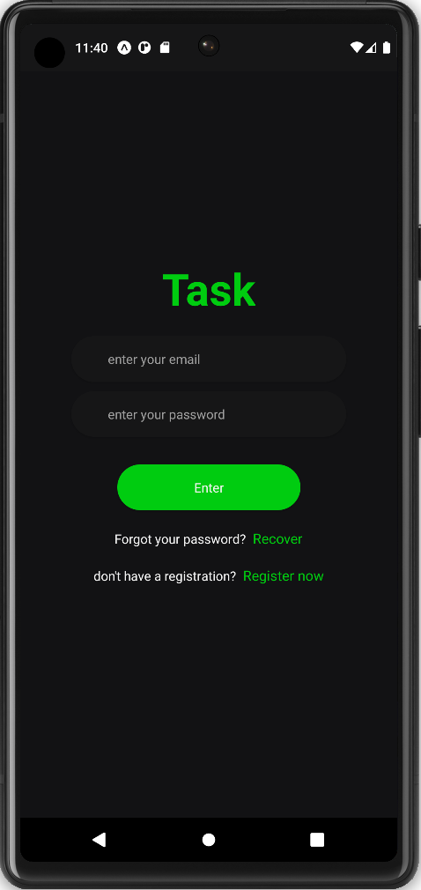
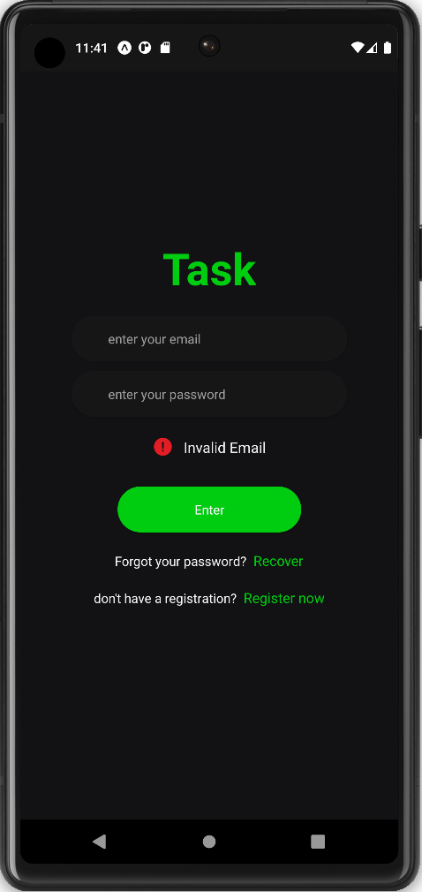
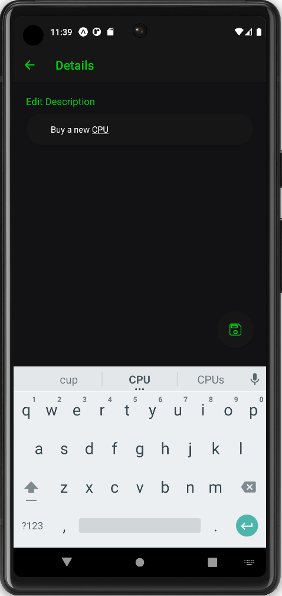
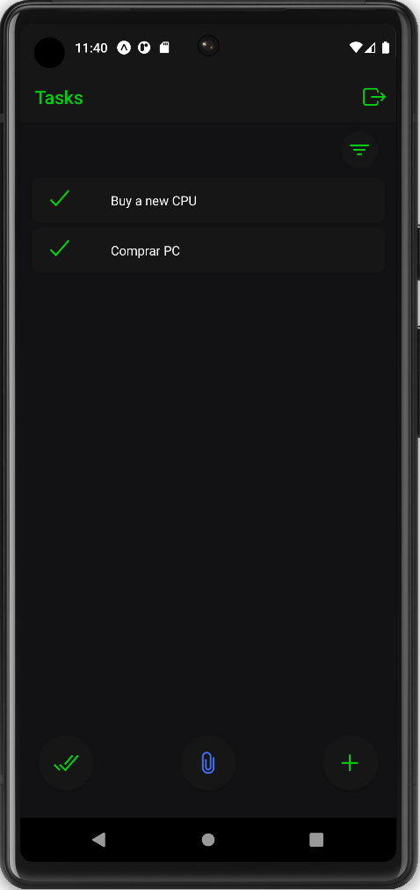
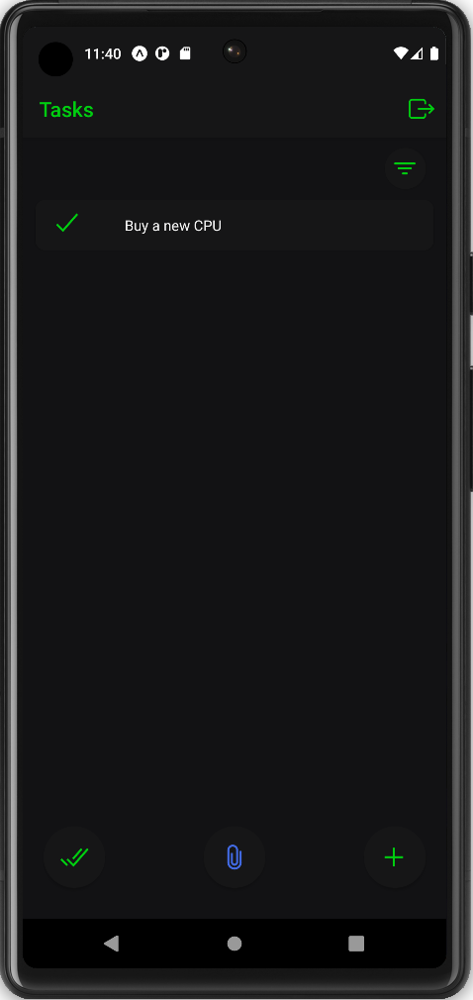
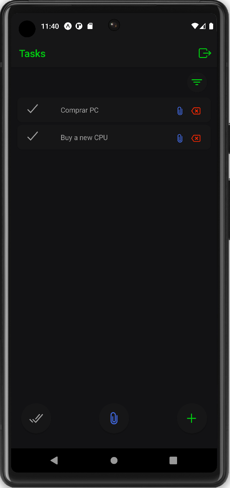
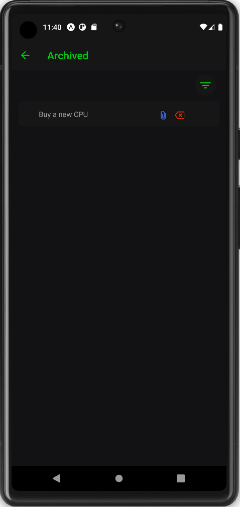

# Tasks App
* React-Native
* Expo
* Firebase
* Yarn

## Features
- [x] Add Task
- [x] Edit Task
- [x] Done Task
- [x] Undone Task
- [x] Archive Task
- [x] Delete Task
- [ ] Create Task Notebook
- [ ] Create Shared Tasks
- [ ] Create Shared Notebook

## Exec
### Install
```
  yarn install
```
### Run
```
  yarn start
```


## Screenshots
<p align="center">
  
  
  
  
  
  
  
  
  
  
</p>
